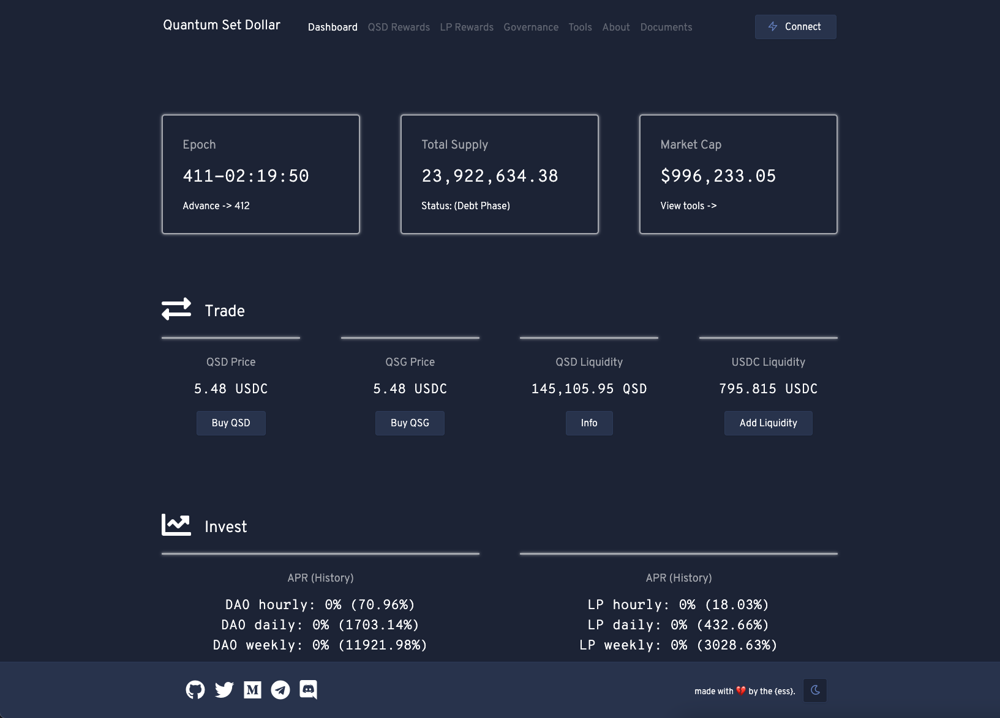

# døllar dashboard
simple dashboard for interacting with the døllar protocol.

forked from [Opyn Monitor](https://opynmonitor.xyz).

## ipfs
for convenience, the current IPFS build of døllar dashboard can be accessed here: [https://emptyset.finance](https://emptyset.finance)

## screenshot


## prerequisites
- install [Node.js](https://nodejs.org/en/download/).

## install & run locally
```shell
git clone git@github.com:emptysetsquad/dollar-dashboard.git
cd dollar-dashboard
npm install

npm start
```

## contracts
### mainnet
- `0xEc9dCB3DC47FF5edc02666cE4Db459841853B7B4` **Root / Bootstrapping rewards**
- `0x9B1B24EB741B435074D8e8c21D62DAeF12b5733d` **Implementation**
- `0x35b4EBBb9bD9d967B1EFE4ccDDCe38F22E38198c` **QSD**
- `0x9f54B1E1122AE6978A70fdE254CA95Ae6Df35459` **QSG**
- `0xD9122DB4cB0E1c42dA965Ee5D25606C7ef607145` **QSG Rewards**
- `0xDBAf2265C74AD30a90B08D14E8097D13B891a2cF` **LP Rewards**
- `0xCd72c0A874782d7D5c85208c1bbAE46c409478dd` **QSD Rewards**

## disclaimer
this project is an experiment, and its contracts are unaudited - we've put a significant amount of work into testing, as well as generally de-risking the design of its core mechanism, however participants should take great caution as bugs resulting in loss of funds are always a possibility.

```
Copyright 2020 Empty Set Squad <emptysetsquad@protonmail.com>

Licensed under the Apache License, Version 2.0 (the "License");
you may not use the included code except in compliance with the License.
You may obtain a copy of the License at

http://www.apache.org/licenses/LICENSE-2.0

Unless required by applicable law or agreed to in writing, software
distributed under the License is distributed on an "AS IS" BASIS,
WITHOUT WARRANTIES OR CONDITIONS OF ANY KIND, either express or implied.
See the License for the specific language governing permissions and
limitations under the License.
```

<br>
made with 💔️ by the {ess}.
